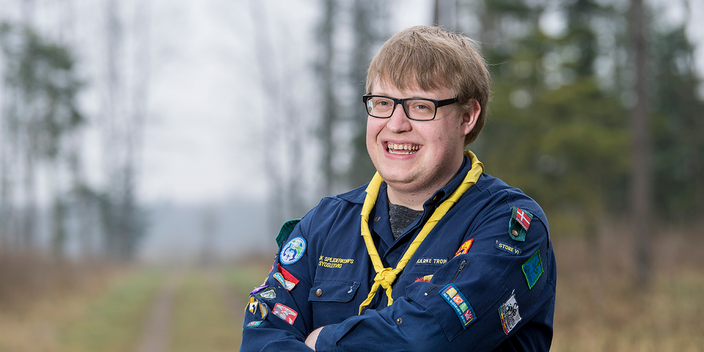
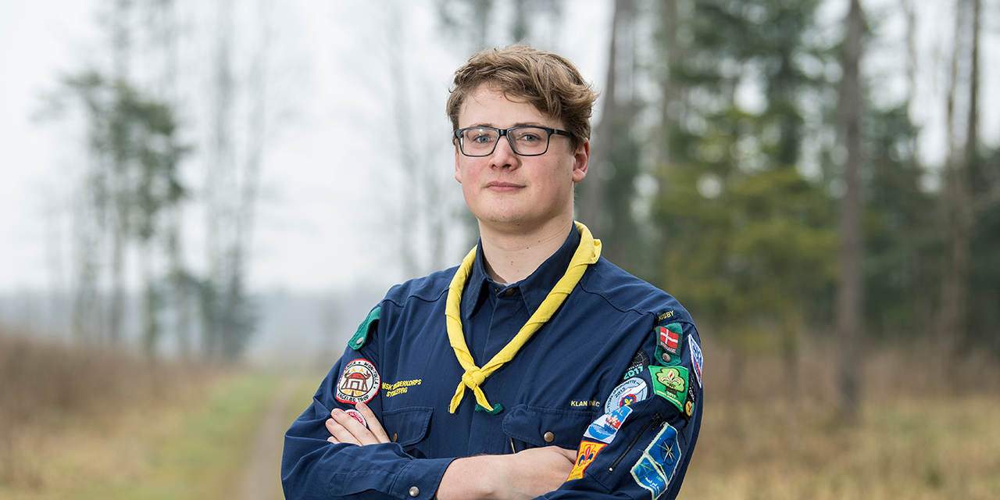

# Mød lejrchef Brian Nielsen

Foto: Martin Ziemer

_Hvorfor synes du det er fedt at skulle være lejrchef for Jamborette 2024?_\
Sommerlejren plejer for de fleste spejdere at være årets højdepunkt. Jeg brænder for at skabe fede oplevelser børn og unge. Som Lejrchef vil jeg gerne sørge for at flest mulige sydslesvigske spejdere vil få en alletiders oplevelse.

_Hvad glæder du dig mest til på Jamborette 2024?_\
Jeg glæder mig til at skabe en uforglemmlig oplevelse for spejdere i alle aldersgrupper. Og så glæder jeg mig vildt meget til når vi allesammen for første gang mødes til åbnings lejrbålet.

_Hvad er din bedste lejroplevelse?_\
Min yndlingslejroplevelse har nok været da jeg 2009 på Blå sommer for første gang var på en kæmpe stor lejr og fandt ud af hvor mange spejdere vi faktisk var. Ellers også vores egen Træning på Tydal, da jeg selv var deltager og for første gang havde kontakt til andre spejder fra andre grupper (Som jeg faktisk stadig har kontakt med idag)

_Hvad er din yndlings spejderaktivitet?_\
Jeg elsker sommerlejre, da man har mulighed for at være på lejr flere dage i træk, og kan udfolde lejrlivet meget mere end kun på en enkelt weekend. Så elsker jeg også at være på spejderløb, da jeg elsker udfordringer og det uventede.

<!-- 
 -->

> **E-mail:** [brian@jamborette.de](mailto:brian@jamborette.de)\
> **Gruppe:** Kærne Gruppe\
> **Fun fact:** I Folkeskolen spillede jeg i et band der hed "Die Zitteraale".

# Mød lejrchef Tor-Salve Dalsgaard

Foto: Martin Ziemer

_Hvorfor synes du det er fedt at være lejrchef for Jamborette 2024?_\
Jamboretten har altid været højdepunkter i mit spejderliv. Det bliver fedt at være med til at skabe en fantastisk lejr, der kan blive endnu et højdepunkt for os alle sammen.

_Hvad glæder du dig mest til på Jamborette 2024?_\
Jeg glæder mig til at se alle spejderne at komme til Tydal for at have en fed lejr. Og så glæder jeg mig til at komme rundt til alle aktiviteterne for at sige hej til alle spejderne.

_Hvad er din bedste lejroplevelse?_\
Min bedste oplevelse var til Jamborette 2011, hvor vi fik lov til at dyrke vores egne grøntsager på lejren.

_Hvad er din yndlings spejderaktivitet?_\
 Jeg elsker at sidde ved lejrbålet og snakke med mine spejdervenner. Ellers, lad os bygge noget!

> **E-mail:** [torsalve@jamborette.de](mailto:torsalve@jamborette.de)\
> **Gruppe:** Angelbo Gruppe\
> **Fun fact:** Ifølge Danmarks Statistik er jeg den eneste Tor-Salve i hele Danmark.